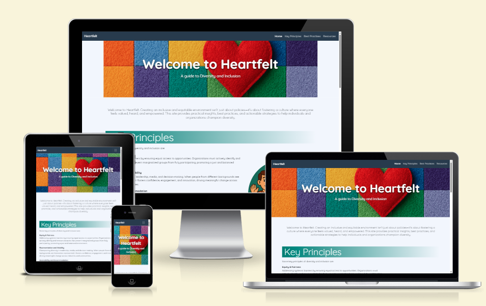
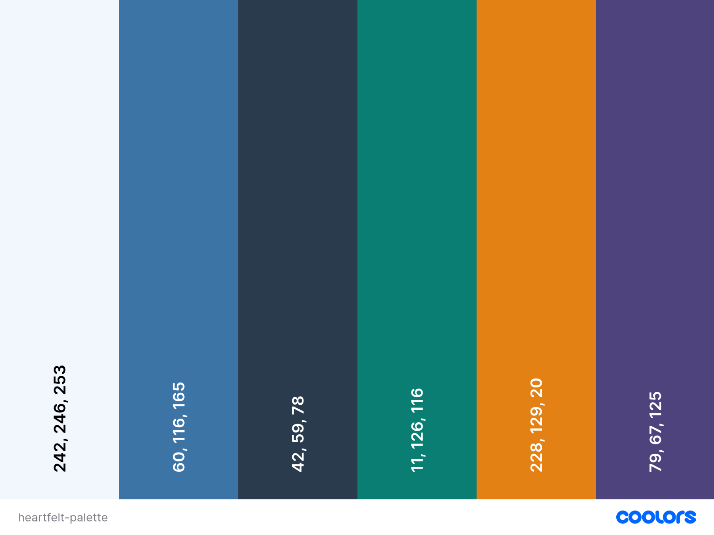
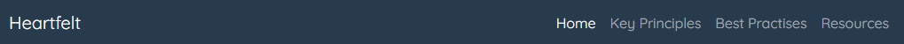
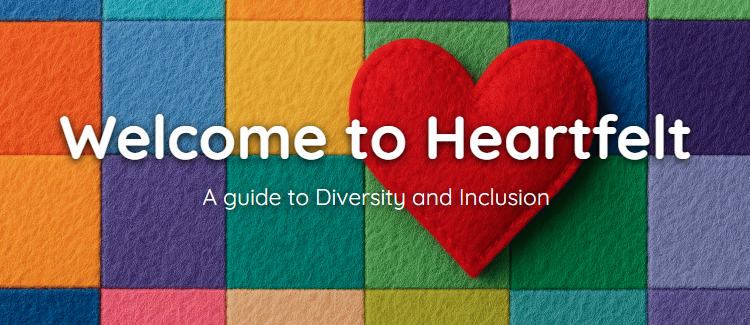
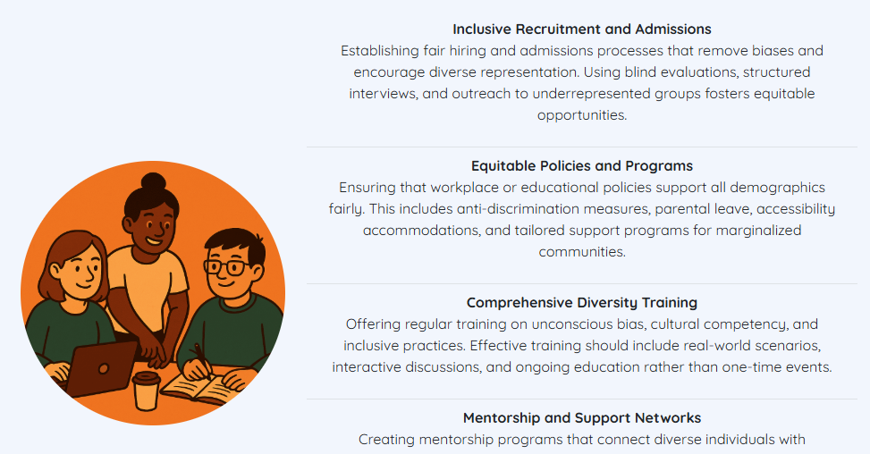
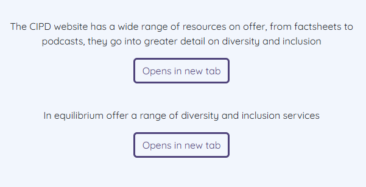
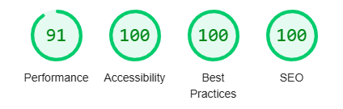
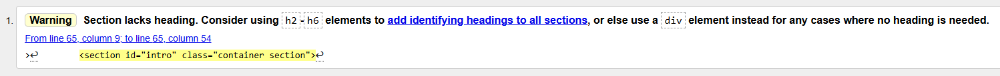

# Portfolio Project 1 | Heartfelt

## By David Noble

## Description

Heartfelt provides visitors with information on diversity and inclusion in the workplace or educational environment. The site provides basic information, a list of tips and best practises, and links to further resources on the topic.

## User Stories

-   As a visitor interested in diversity and inclusion, I want to see a visually appealing hero section with a compelling message, so that I immediately grasp the purpose of the webpage.

-   As a user seeking straightforward information about diversity and inclusion, I want the content divided into clearly defined sections, so that I can easily understand and digest key concepts.

-   As a user looking for actionable guidance, I want to see a list of practical tips on promoting diversity and inclusion, so that I have clear steps to follow in my workplace or educational setting.

-   As a user interested in exploring further, I want resource links styled as buttons, so that I can easily navigate to additional external materials on diversity and inclusion.

-   As a site user, I can use the navbar to easily navigate around the website.

## Wireframes

<a href="./assets/images/mobile-wireframe.png" target="_blank">Wireframe for mobile</a>

<a href="./assets/images/tablet-wireframe.png" target="_blank">Wireframe for tablet</a>

<a href="./assets/images/desktop-wireframe.png" target="_blank">Wireframe for desktop</a>

## Features

**Colour Palette**

The base colours chosen for the website were variants of blue, for a calm and professional appearance. The colours for the sites headings and sections were taken from the site's hero image using a colour sampler.

**Navbar**

The site features a bootstrap navbar, using a charcoal blue for the background colour and a light theme for text contrast.

**Hero image**

A bright and colourful header was generated using Microsoft Pilot. The image of a felt heart on a felt background is a play on the word Heartfelt.

**Section headings**

Colour samples from the hero image were used for the section headings, to tie in with the overall theme of the site, providing eye-catching sections.

**Images**

Images were generated using Microsoft Pilot, representing the theme of each section, with a primary colour that matched the headings. The site's responsive design places the image after the text on small screen sizes and beside the text for larger screens.

**Buttons**

Bootstrap's buttons were used to provide links to external resources, they were styled to be the same colour as their section heading.

**Footer**

A simple footer with links to social media was created, fontawesome was used to provide the icons for the links, which change colour when hovered over with a mouse.

## Use of AI in this project

AI was used for a variety of tasks throughout the project. The use of AI reduced the time spent resolving code issues, and finding content for the website.

**Image Generation**

All images on the website were generated using Microsoft Pilot.

**Code Generation**

A simple prompt in copilot generated the code for the header section, which was manually adjusted to incorporate the correct image. AI was used to resolve an issue with the footer text not being vertically aligned in the centre of the footer.

**Content Generation**

The text content of the website was generated using prompts on Microsoft Pilot.

**Validation**

"Lighthouse" was used to review the page's performance, accessibility, best practises, and SEO. Any issues flagged were addressed to ensure an optimised site experience.

## Deployment

For a preview of the website the code has been deployed on GitHub pages. This was done at the start of the project to for device testing throughout the project build.

The steps for deployment via GitHub pages are:

1. Log in to GitHub account
2. Navigate to the GitHub [repository](https://github.com/dav-noble/project-1-heartfelt) for the project
3. Click on the "Settings" tab
4. Click on "Pages" under the "Code and automation" section in the sidebar
5. Select the "main" branch from the dropdown menu under the "Branch" section
6. Click "Save"
7. Refresh the page to show the link to the deployed website (this can take a few minutes to appear)
8. The site should be successfully deployed.

## Testing

**Lighthouse**

Initial testing using the developer tools' "Lighthouse" flagged some issues.

Performance was reduced by image size, resolved by using an image compression site, [iLoveIMG](https://www.iloveimg.com/compress-image).

Images not having "alt" attributes was flagged and quickly resolved.

The site did not have a meta description, reducing the SEO score, a short description was added resolving the issue.

The final lighthouse scores are as follows:

### Validation

**HTML:**

The site's code was validated using W3C Markup Validation Service.

A single error was flagged showing that a heading element was not used for the intro section. This was resolved by changing the "section" to a div.

**CSS:**

CSS was validated using W3C CSS Validation Service.

No errors were found.
